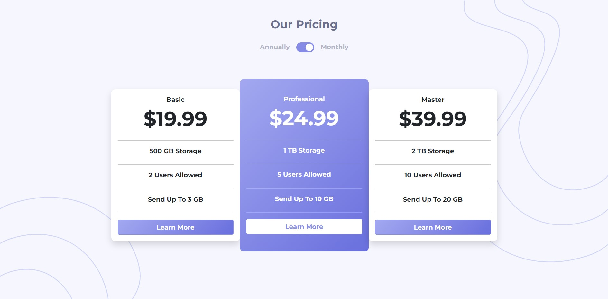

# Frontend Mentor - Pricing component with toggle solution

This is a solution to the [Pricing component with toggle challenge on Frontend Mentor](https://www.frontendmentor.io/challenges/pricing-component-with-toggle-8vPwRMIC). Frontend Mentor challenges help you improve your coding skills by building realistic projects.  

## Table of Contents

- [Overview](#overview)
  - [The challenge](#the-challenge)
  - [Screenshot](#screenshot)
  - [Links](#links)
- [My process](#my-process)
  - [Built with](#built-with)
  - [What I learned](#what-i-learned)
  - [Continued development](#continued-development)
  - [Useful resources](#useful-resources)
- [Acknowledgments](#acknowledgments)


## Overview 

### The challenge

Users should be able to:

- View the optimal layout for the component depending on their device's screen size
- Control the toggle with both their mouse/trackpad and their keyboard
- **Bonus**: Complete the challenge with just HTML and CSS

### Screenshot



### Links

- [GitHub Repo URL](https://github.com/adrvnc/pricing-component)
- [Live Site URL](https://adrvnc.github.io/pricing-component/)

## My Process


### Built With 

- HTML 
- CSS
- Bootstrap 5.1.3
- JavaScript 
### What I Learned 

While working on this project, I familiarzed myself `for` loops, `if` statements, and variable declarations.

### Continued Development 

I want to become better acquainted with VanillaJS as I build future projects. 


### Useful Resources 

 - [Var, Let, and Const – What's the Difference?](https://www.freecodecamp.org/news/var-let-and-const-whats-the-difference/) - This article helped me understand why `let` is preferred for variable declaration instead of `var`. 
## Acknowledgements

I want to give a shoutout to Muhammad Asif's [Solution](https://codeconvey.com/pricing-table-with-css-switch-toggle/).
I used and modified his javascript code which helped me create a 
working toggle switch to change the pricing. 

```js
function priceChange() {
  let toggleSwitch = document.getElementById("toggleSwitch");
  let price1 = document.getElementsByClassName("price1");
  let price2 = document.getElementsByClassName("price2");

  for (let i = 0; i < price1.length; i++) {
    if (toggleSwitch.checked == true) {
      price1[i].style.display = "block";
      price2[i].style.display = "none";
    } else if (toggleSwitch.checked == false) {
      price1[i].style.display = "none";
      price2[i].style.display = "block";
    }
  }
}
priceChange();
``` 

